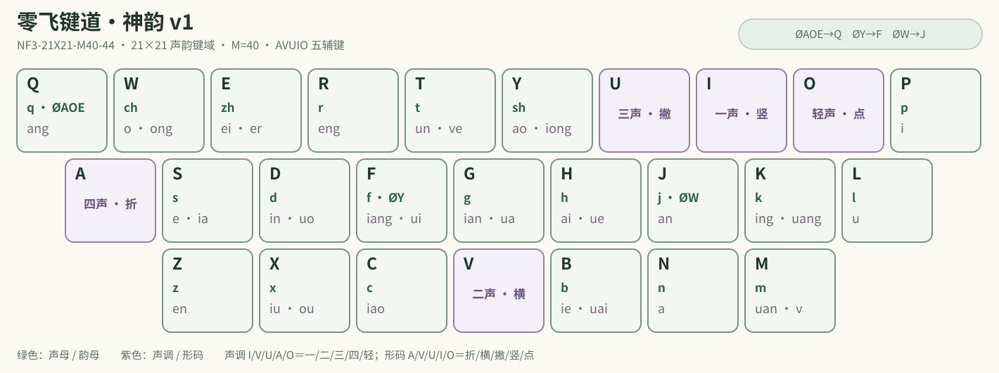

# 冰雪拼音

> 优雅、高效、个性化的中文输入体验

配方： ℞ **snow-pinyin**

[冰雪拼音](https://input.tansongchen.com)是一系列以普通话拼音为基础的中文输入方案。它们充分利用汉字的字音信息来实现自然优雅的编码；它们使用先进的离散优化技术和顶功技术来设计，使得编码十分高效；它们配备了智能算法，通过学习用户的语言习惯来个性化输入体验。

冰雪拼音包括[冰雪四拼](https://input.tansongchen.com/snow4/)、[冰雪三拼](https://input.tansongchen.com/snow3/)、[冰雪双拼](https://input.tansongchen.com/snow2/)、[冰雪一拼](https://input.tansongchen.com/snow1/)和[冰雪键道](https://input.tansongchen.com/snow-jiandao/)输入方案。您可以阅读[冰雪奇缘](https://input.tansongchen.com/snow.html)来概览各个方案，了解它们的设计理念及优缺点。您还可以点击上述各个方案的链接以进一步了解并选择适合您的输入方案。

## 零飞键道·神韵 v1 双拼编码

冰雪键道和冰雪三拼现共用 **零飞键道·神韵 v1** 双拼编码，对应公开测评中的 `NF3-21X21-M40-44`。它从 314 个固定单首键候选中选出，是 21×21 键域、五辅键 `AVUIO`、声韵记忆量 M=40 的九轴非支配候选之一，定位为低记忆 21 键双拼的综合性能第一梯队。这里的“零飞键道·神韵 v1”是本仓库的用户向名称，内部编号继续保留，便于复核和复现。



- 21 个普通声母均使用固定首键；`zh/ch/sh → E/W/Y`。
- 零声母载体为 `AOE/Y/W → Q/F/J`。
- 声调 `I/V/U/A/O → 一/二/三/四/轻`；键道形码 `A/V/U/I/O → 折/横/撇/竖/点`。
- `hng、m、n、ng、ê` 不在目标 416 个扩展音节编码范围内；其余音节已与冻结报告逐项核对。

### 与首道 26 键双拼的同口径比较

下表来自 [shuangpin-layout-benchmark 的 NF3 冻结报告](https://github.com/more-14-different/shuangpin-layout-benchmark)，比较对象为其中的 `B04 首道双拼`。两者使用相同码表、语料、成本模型和编码合同；数值不是跨版本拼接，也不等同于真实用户测速。耗时及综合分越低越好，交替率、主键区占比和 LU 越高越好。

| 指标 | 神韵 v1（21×21） | 首道 B04（26×26） | 公平解读 |
| --- | ---: | ---: | --- |
| 声韵记忆量 M | 40 | 40 | 相同记忆预算 |
| 裸二键唯一音节 | 378 / 399 | 399 / 399 | 首道无须消歧，神韵有 21 个重码音节 |
| CKT-S2 裸二键耗时 | 71.705 ms/项 | 79.890 ms/项 | 神韵低 10.25% |
| 补全后 CKT | 81.719 ms/项 | 79.890 ms/项 | 计入等长五进制消歧后，神韵高 2.29% |
| A7E-v5 综合分 | 10.5962 | 11.0912 | 神韵低 4.46%；但因裸码非全唯一，不参与严格无重码前沿授标 |
| A7E-v4 历史综合分 | 10.8854 | 10.5833 | 首道低 2.85% |
| 同指连击率 SFB | 4.11% | 11.34% | 神韵少 7.23 个百分点 |
| 同键率 | 2.51% | 4.56% | 神韵少 2.05 个百分点 |
| 左右手交替率 | 52.55% | 56.33% | 首道高 3.79 个百分点 |
| 主键区占比 | 48.65% | 36.60% | 神韵高 12.05 个百分点 |
| 右小指负载 | 9.00% | 1.26% | 神韵高 7.74 个百分点，是需要正视的代价 |
| LU-v1r 规则一致性 | 78.43 | 83.11 | 首道高 4.68 分 |

因此，神韵 v1 的优势不是“每一项都赢”，而是在只占用 21 个声韵键、保持 M=40 的条件下，取得更低的裸二键 CKT、更少的同指连击和更高的主键区覆盖；代价是音节重码、补全成本、右小指负载以及部分规则一致性。完整交互报告、测量定义与复现材料见 [Benchmark Releases](https://github.com/more-14-different/shuangpin-layout-benchmark/releases)。本仓库还提供映射校验脚本：

```powershell
bun scripts/验证神韵双拼.ts "路径/a7_CKT_NF3_closure.html"
```

该脚本会直接解压报告 payload，并将实现与 `NF3-21X21-M40-44` 的 421 个音节逐项比较。

### 神韵固顶空间

神韵的固顶词不是从旧双拼机械移码，而是按当前 21 主码键、5 辅码键和词典重新联合选优：

- `AA` 的 441 个位置由 377 个二码单字与 64 个二简完整覆盖。53 个二简使用天然音码空位，另外 11 个让极冷音码下沉到第三键，以换取高频二简。
- 三拼 630 使用“首字声键＋第二字声调”，第三键对二字词取第一字声调，对三字以上词取第三字声调；轻声尾键优先承载自然的三、四字表达。
- 键道 630 使用“首字声键＋第二字前一至二形码”；键道三码单字使用“完整音码＋首形”。
- 每个码位只固定一个候选；同一固顶空间不重复词，父码与子码也不连续固定同一个字词。低质量冷槽允许留空，不为凑满数量强塞词条。

固顶表是可复现的编译产物。生成器把主码键、辅码键、音节码表、声调键和形码键作为布局配置，因此也可用于其他“21 主码键＋5 个互斥辅码键”的键盘分布：

```powershell
bun scripts/生成神韵固顶词.ts
bun scripts/生成神韵固顶词.ts --check
bun scripts/验证神韵双拼.ts
```

批量校验会检查空间数量、编码公式、一码一候选、父子码重复、词语重复以及生成结果是否过期。

## 关于词库的说明

冰雪拼音词库收词范围与[雾凇拼音](http://github.com/iDvel/rime-ice)相同。其特点为：

1. 大词库：与雾凇拼音共享 180 万词库
2. 持续更新：上游雾凇拼音更新后，本仓库也会随之更新
3. 单字读音遵循《通用规范汉字字典》规范
4. 词语读音尽可能使用单字已有的读音，便于自动造词。这意味着
    - 不考虑因弱化产生的轻声，如「知识」为 `zhī shí`，不为 `zhī shi`
    - 不考虑连读变调，如「一个」为 `yī gè`，不为 `yí gè`
    - 部分专有名词中的专用音允许例外，例如「冒顿」可以是 `mò dú`
