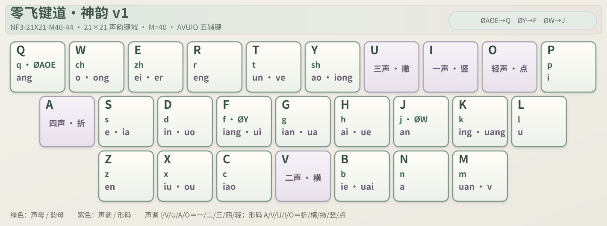
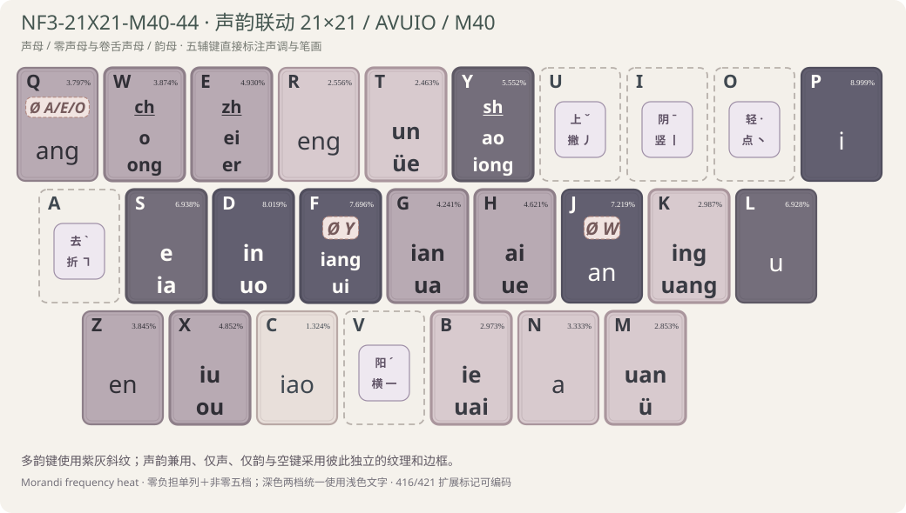

# 冰雪拼音

> 优雅、高效、个性化的中文输入体验

[简体中文](#简体中文) · [English](#english) · [繁體中文](#繁體中文) · [下载 Release](https://github.com/ChenZhu-Xie/rime-snow-pinyin/releases/latest)

<a id="简体中文"></a>
## 简体中文

配方： ℞ **snow-pinyin**

[冰雪拼音](https://input.tansongchen.com)是一系列以普通话拼音为基础的中文输入方案。它们充分利用汉字的字音信息来实现自然优雅的编码；它们使用先进的离散优化技术和顶功技术来设计，使得编码十分高效；它们配备了智能算法，通过学习用户的语言习惯来个性化输入体验。

冰雪拼音包括[冰雪四拼](https://input.tansongchen.com/snow4/)、[冰雪三拼](https://input.tansongchen.com/snow3/)、[冰雪双拼](https://input.tansongchen.com/snow2/)、[冰雪一拼](https://input.tansongchen.com/snow1/)和[冰雪键道](https://input.tansongchen.com/snow-jiandao/)输入方案。您可以阅读[冰雪奇缘](https://input.tansongchen.com/snow.html)来概览各个方案，了解它们的设计理念及优缺点。您还可以点击上述各个方案的链接以进一步了解并选择适合您的输入方案。

### 零飞键道·神韵 v1 双拼编码

冰雪键道和冰雪三拼现共用 **零飞键道·神韵 v1** 双拼编码，对应公开测评中的 `NF3-21X21-M40-44`。它从 314 个固定单首键候选中选出，是 21×21 键域、五辅键 `AVUIO`、声韵记忆量 M=40 的九轴非支配候选之一，定位为低记忆 21 键双拼的综合性能第一梯队。这里的“零飞键道·神韵 v1”是本仓库的用户向名称，内部编号继续保留，便于复核和复现。

**声韵映射**



**当前路径键频**



#### 声韵编码规则

普通声母均使用固定首键：

| 声母 | 首键 | 声母 | 首键 | 声母 | 首键 |
| --- | :---: | --- | :---: | --- | :---: |
| b | B | p | P | m | M |
| f | F | d | D | t | T |
| n | N | l | L | g | G |
| k | K | h | H | j | J |
| q | Q | x | X | zh | E |
| ch | W | sh | Y | r | R |
| z | Z | c | C | s | S |

零声母按拼音开头分组；表中直接列出“音节=完整双拼码”：

| 前导组 | 首键 | 完整音节编码 |
| --- | :---: | --- |
| ØA | Q | a=QN · ai=QH · an=QJ · ang=QQ · ao=QY |
| ØE | Q | e=QS · ei=QE · en=QZ · eng=QR · er=QE |
| ØO | Q | o=QW · ou=QX |
| ØY | F | ya=FN · yan=FJ · yang=FQ · yao=FY · ye=FS · yi=FP · yin=FD · ying=FK · yo=FW · yong=FW · you=FX · yu=FL · yuan=FM · yue=FH · yun=FT |
| ØW | J | wa=JN · wai=JH · wan=JJ · wang=JQ · wei=JE · wen=JZ · weng=JR · wo=JW · wu=JL |

韵母使用第二键；`v` 表示 `ü`，`ve` 表示 `üe`：

| 第二键 | 韵母 | 第二键 | 韵母 | 第二键 | 韵母 |
| :---: | --- | :---: | --- | :---: | --- |
| N | a | H | ai / ue | J | an |
| Q | ang | Y | ao / iong | S | e / ia |
| E | ei / er | Z | en | R | eng |
| P | i | G | ian / ua | F | iang / ui |
| C | iao | B | ie / uai | D | in / uo |
| K | ing / uang | X | iu / ou | W | o / ong |
| L | u | M | uan / v（ü） | T | un / ve（üe） |

- 21 个普通声母均使用固定首键；`zh/ch/sh → E/W/Y`。
- 零声母载体为 `AOE/Y/W → Q/F/J`。
- 声调 `I/V/U/A/O → 一/二/三/四/轻`；键道形码 `A/V/U/I/O → 折/横/撇/竖/点`。
- `hng、m、n、ng、ê` 不在目标 416 个扩展音节编码范围内；其余音节已与冻结报告逐项核对。

#### 与原键道 21 键双拼的同口径比较

下表来自 [shuangpin-layout-benchmark 的 NF3 冻结报告](https://github.com/more-14-different/shuangpin-layout-benchmark)，比较对象为恢复自 PR1 快照的 `S005 冰雪键道双拼（原作基线）`。两者使用相同音节表、字词语料、成本模型、形码数据和编码合同，因此可以作同口径比较；数值仍是模型测评，不等同于真实用户测速。耗时及综合分越低越好，LU 越高越好。

| 指标 | 神韵 v1（21×21） | 原键道 S005（21 键） | 公平解读 |
| --- | ---: | ---: | --- |
| 声韵记忆量 M | 40 | 40 | 相同记忆预算 |
| 普通声母首键 | 21 个声母各自固定 | `ch/zh` 依韵母取条件首键 | 神韵规则更统一，无须回看韵母决定首键 |
| 裸二键唯一音节 | 378 / 399 | 372 / 399 | 神韵多 6 个唯一音节 |
| CKT-S2 裸二键耗时 | 71.705 ms/项 | 82.029 ms/项 | 神韵低 12.59% |
| 补全后 CKT | 81.719 ms/项 | 90.149 ms/项 | 神韵低 9.35% |
| A7E-v5 综合分 | 10.5962 | 11.3770 | 神韵低 6.86% |
| A7E-v4 历史综合分 | 10.8854 | 10.7329 | 原键道低 1.42% |
| LU 规则一致性 | 78.43（v1r） | 78.90（历史值） | 原键道高约 0.47 分；版本口径不同，仅作旁证 |

在相同记忆预算和测评合同下，神韵 v1 的主要优势是首键规则更统一、裸二键唯一音节更多，并同时降低裸二键及补全后的 CKT；A7E-v5 也更低。代价是 A7E-v4 历史分略高，LU 旁证略低。原键道保留条件首键，而神韵把 21 个普通声母全部收敛为固定首键，降低了输入时的规则分支。

#### 与首道 26 键双拼的同环境测评

下表同样来自 [shuangpin-layout-benchmark 的 NF3 冻结报告](https://github.com/more-14-different/shuangpin-layout-benchmark)，比较对象为其中的 `B04 首道双拼`。两者在相同码表、语料、成本模型和编码合同的测评环境中计算，但键域分别为 21×21 与 26×26，因此这里称为同环境测评，而不是同键域比较。数值不等同于真实用户测速。耗时及综合分越低越好，交替率、主键区占比和 LU 越高越好。

| 指标 | 神韵 v1（21×21） | 首道 B04（26×26） | 公平解读 |
| --- | ---: | ---: | --- |
| 声韵记忆量 M | 40 | 40 | 相同记忆预算 |
| 裸二键唯一音节 | 378 / 399 | 399 / 399 | 首道无须消歧，神韵有 21 个重码音节 |
| CKT-S2 裸二键耗时 | 71.705 ms/项 | 79.890 ms/项 | 神韵低 10.25% |
| 补全后 CKT | 81.719 ms/项 | 79.890 ms/项 | 计入等长五进制消歧后，神韵高 2.29% |
| A7E-v5 综合分 | 10.5962 | 11.0912 | 神韵低 4.46%；但因裸码非全唯一，不参与严格无重码前沿授标 |
| A7E-v4 历史综合分 | 10.8854 | 10.5833 | 首道低 2.85% |
| 同指连击率 SFB | 4.11% | 11.34% | 神韵少 7.23 个百分点 |
| 同键率 | 2.51% | 4.56% | 神韵少 2.05 个百分点 |
| 左右手交替率 | 52.55% | 56.33% | 首道高 3.79 个百分点 |
| 主键区占比 | 48.65% | 36.60% | 神韵高 12.05 个百分点 |
| 右小指负载 | 9.00% | 1.26% | 神韵高 7.74 个百分点，是需要正视的代价 |
| LU-v1r 规则一致性 | 78.43 | 83.11 | 首道高 4.68 分 |

因此，神韵 v1 的优势不是“每一项都赢”，而是在只占用 21 个声韵键、保持 M=40 的条件下，取得更低的裸二键 CKT、更少的同指连击和更高的主键区覆盖；代价是音节重码、补全成本、右小指负载以及部分规则一致性。完整交互报告、测量定义与复现材料见 [Benchmark Releases](https://github.com/more-14-different/shuangpin-layout-benchmark/releases)。本仓库还提供映射校验脚本：

```powershell
bun scripts/验证神韵双拼.ts "路径/a7_CKT_NF3_closure.html"
```

该脚本会直接解压报告 payload，并将实现与 `NF3-21X21-M40-44` 的 421 个音节逐项比较。

#### 神韵固顶空间

神韵的固顶词不是从旧双拼机械移码，而是按当前 21 主码键、5 辅码键和词典重新联合选优：

- `AA` 的 441 个位置由 377 个二码单字与 64 个二简完整覆盖。53 个二简使用天然音码空位，另外 11 个让极冷音码下沉到第三键，以换取高频二简。
- 三拼 630 使用“首字声键＋第二字声调”，第三键对二字词取第一字声调，对三字以上词取第三字声调；轻声尾键优先承载自然的三、四字表达。
- 键道 630 使用“首字声键＋第二字前一至二形码”；键道三码单字使用“完整音码＋首形”。
- 三拼和键道均可在候选后按 `;` 补“的”、按 `/` 补“了”并立即上屏；这组尾字键正是受四拼同类设计启发。单打“的/了”时也可直接按 `;`/`/`，比 `d`/`l` 后再按空格少一键且保持顶功；原有 `d → 的`、`l → 了` 继续保留，用户无须强制迁移到右小指。
- 选优器同时理解上述尾字键和[冰雪结构略码](https://input.tansongchen.com/snow4/advanced.html#略码)。多字词若以轻声 `de/le` 结尾，一律改走尾字键；凡符合完整重复、部分重复或插入重复等结构略码规则的词，也不再占用二简、630 或其他固定简码位。判断按读音进行，因此“目的（dì）”等词不受影响。
- 固顶收益按实际输入难度而不是裸词频衡量：逻辑连接、日常应答和完整四码非首选的常用词优先；像 `jkjp → 经济` 这样同码兄弟多、但完整码已明显稳居首选的窄领域词主动让位。当前表已覆盖“如果、应该、测试、那么、以及、好吧、好的吧、行吧、行叭”等表达。
- 每个码位只固定一个候选；同一固顶空间不重复词，父码与子码也不连续固定同一个字词。低质量冷槽允许留空，不为凑满数量强塞词条。

以启用结构略码前的 `1ffca15` 为基线，三拼共调整 70 个槽位：53 个轻声 `de/le` 尾词按尾字键策略让位，12 个旧固顶已有等长或更短的结构略码，4 个迁移到其他固顶位，另有“我们的心”经质量复核让位给更自然且有外部简码证据的“忘了吧”。键道共调整 36 个槽位：19 个尾词让位、12 个结构略码替代、5 个迁移。被取消固顶的普通词仍可按完整编码输入；比较器确认没有无策略丢失。

在此基础上的日常语用复核相对 `v0.3.9` 又调整三拼 62 槽、键道 52 槽：三拼分别有 20 个结构略码让位、3 个完整码首选让位、31 个日常语用让位和 8 个迁移；键道分别为 11、1、26、14。两表均无未归因丢失。

固顶表是可复现的编译产物。生成器把主码键、辅码键、音节码表、声调键和形码键作为布局配置，因此也可用于其他“21 主码键＋5 个互斥辅码键”的键盘分布：

```powershell
bun scripts/生成神韵固顶词.ts
bun scripts/生成神韵固顶词.ts --check
bun scripts/分析神韵固顶替代.ts --baseline=1ffca15
bun scripts/验证神韵双拼.ts
```

批量校验会检查空间数量、编码公式、一码一候选、父子码重复、词语重复、生成结果是否过期、多字轻声 `de/le` 尾词及结构略码词是否误占固顶位。比较器会把“尾字键策略让位”“结构略码让位”“完整码首选让位”“日常语用让位”“迁移”“新增”和“无策略丢失”分开统计，并在最后一项非零时失败。

### 关于词库的说明

冰雪拼音词库收词范围与[雾凇拼音](http://github.com/iDvel/rime-ice)相同。其特点为：

1. 大词库：与雾凇拼音共享 180 万词库
2. 持续更新：上游雾凇拼音更新后，本仓库也会随之更新
3. 单字读音遵循《通用规范汉字字典》规范
4. 词语读音尽可能使用单字已有的读音，便于自动造词。这意味着
    - 不考虑因弱化产生的轻声，如「知识」为 `zhī shí`，不为 `zhī shi`
    - 不考虑连读变调，如「一个」为 `yī gè`，不为 `yí gè`
    - 部分专有名词中的专用音允许例外，例如「冒顿」可以是 `mò dú`

---

<a id="english"></a>
## English

Recipe: ℞ **snow-pinyin**

[Snow Pinyin](https://input.tansongchen.com) is a family of Mandarin-based Chinese input methods. It combines phonetic information, discrete optimization, top-up coding, and adaptive learning for natural, efficient, and personalized input. The family includes [Snow Four-Code](https://input.tansongchen.com/snow4/), [Snow Three-Code](https://input.tansongchen.com/snow3/), [Snow Double Pinyin](https://input.tansongchen.com/snow2/), [Snow One-Code](https://input.tansongchen.com/snow1/), and [Snow KeyTao](https://input.tansongchen.com/snow-jiandao/).

### LingFei KeyTao · Shenyun v1 double-pinyin layout

Snow KeyTao and Snow Three-Code now share **LingFei KeyTao · Shenyun v1**, published in the benchmark as `NF3-21X21-M40-44`. Selected from 314 fixed-first-key layouts, it is a nine-objective non-dominated candidate in the 21×21 domain with five auxiliary keys `AVUIO` and memory load M=40.

**Initial/final mapping**


**Current-path key-frequency heat map**


#### Initial/final coding rules

Every ordinary initial uses one fixed first key:

| Initial | First key | Initial | First key | Initial | First key |
| --- | :---: | --- | :---: | --- | :---: |
| b | B | p | P | m | M |
| f | F | d | D | t | T |
| n | N | l | L | g | G |
| k | K | h | H | j | J |
| q | Q | x | X | zh | E |
| ch | W | sh | Y | r | R |
| z | Z | c | C | s | S |

Zero-onset syllables are grouped by their written Pinyin prefix; each cell gives `syllable=complete code`:

| Carrier group | First key | Complete syllable codes |
| --- | :---: | --- |
| ØA | Q | a=QN · ai=QH · an=QJ · ang=QQ · ao=QY |
| ØE | Q | e=QS · ei=QE · en=QZ · eng=QR · er=QE |
| ØO | Q | o=QW · ou=QX |
| ØY | F | ya=FN · yan=FJ · yang=FQ · yao=FY · ye=FS · yi=FP · yin=FD · ying=FK · yo=FW · yong=FW · you=FX · yu=FL · yuan=FM · yue=FH · yun=FT |
| ØW | J | wa=JN · wai=JH · wan=JJ · wang=JQ · wei=JE · wen=JZ · weng=JR · wo=JW · wu=JL |

Finals use the second key; `v` denotes `ü`, and `ve` denotes `üe`:

| Second key | Finals | Second key | Finals | Second key | Finals |
| :---: | --- | :---: | --- | :---: | --- |
| N | a | H | ai / ue | J | an |
| Q | ang | Y | ao / iong | S | e / ia |
| E | ei / er | Z | en | R | eng |
| P | i | G | ian / ua | F | iang / ui |
| C | iao | B | ie / uai | D | in / uo |
| K | ing / uang | X | iu / ou | W | o / ong |
| L | u | M | uan / v (ü) | T | un / ve (üe) |

- All 21 ordinary initials have fixed first keys; `zh/ch/sh → E/W/Y`.
- Zero-onset carriers are `AOE/Y/W → Q/F/J`.
- Tone keys are `I/V/U/A/O → 1/2/3/4/neutral`; KeyTao shape keys are `A/V/U/I/O → bend/horizontal/left-falling/vertical/dot`.
- `hng, m, n, ng, ê` are outside the 416 encoded extended syllables; all other syllables were checked against the frozen report.

#### Like-for-like comparison with the original 21-key KeyTao layout

The frozen NF3 report in [shuangpin-layout-benchmark](https://github.com/more-14-different/shuangpin-layout-benchmark) restores `S005`, the original Snow KeyTao baseline from the PR1 snapshot. S005 and Shenyun share the same syllable table, corpora, cost model, shape data, and encoding contract, so this is a like-for-like model comparison rather than a real-world typing-speed claim. Lower timing and aggregate scores are better; higher LU is better.

| Metric | Shenyun v1 (21×21) | Original KeyTao S005 (21 keys) | Interpretation |
| --- | ---: | ---: | --- |
| Memory load M | 40 | 40 | Same memory budget |
| First-key rule | One fixed key for each of 21 initials | `ch/zh` use final-dependent branches | Shenyun removes the need to inspect the final before choosing the first key |
| Unique bare two-key syllables | 378 / 399 | 372 / 399 | Shenyun has 6 more unique syllables |
| CKT-S2 bare timing | 71.705 ms/item | 82.029 ms/item | Shenyun is 12.59% lower |
| Completion-aware CKT | 81.719 ms/item | 90.149 ms/item | Shenyun is 9.35% lower |
| A7E-v5 aggregate score | 10.5962 | 11.3770 | Shenyun is 6.86% lower |
| Historical A7E-v4 score | 10.8854 | 10.7329 | Original KeyTao is 1.42% lower |
| LU rule consistency | 78.43 (v1r) | 78.90 (historical) | Original KeyTao is about 0.47 higher; versions differ, so this is supporting evidence only |

With the same memory budget and evaluation contract, Shenyun provides a simpler fixed-initial rule, six more unique bare codes, lower bare and completion-aware CKT, and a lower A7E-v5 score. Its trade-offs are a slightly higher historical A7E-v4 score and slightly lower LU supporting evidence.

#### Same-environment evaluation against 26-key Shoudao

The same report evaluates Shenyun and `B04 Shoudao` with a shared code table, corpus, cost model, and encoding contract. Their domains differ—21×21 versus 26×26—so this is a same-environment evaluation, not a same-domain comparison.

| Metric | Shenyun v1 (21×21) | Shoudao B04 (26×26) | Interpretation |
| --- | ---: | ---: | --- |
| Memory load M | 40 | 40 | Same memory budget |
| Unique bare two-key syllables | 378 / 399 | 399 / 399 | Shoudao needs no disambiguation; Shenyun has 21 colliding syllables |
| CKT-S2 bare timing | 71.705 ms/item | 79.890 ms/item | Shenyun is 10.25% lower |
| Completion-aware CKT | 81.719 ms/item | 79.890 ms/item | Shenyun is 2.29% higher after equal-length base-five disambiguation |
| A7E-v5 aggregate score | 10.5962 | 11.0912 | Shenyun is 4.46% lower, but is excluded from the strict collision-free frontier award |
| Historical A7E-v4 score | 10.8854 | 10.5833 | Shoudao is 2.85% lower |
| Same-finger bigram rate | 4.11% | 11.34% | Shenyun is lower by 7.23 percentage points |
| Same-key rate | 2.51% | 4.56% | Shenyun is lower by 2.05 percentage points |
| Hand alternation | 52.55% | 56.33% | Shoudao is higher by 3.79 percentage points |
| Home-area share | 48.65% | 36.60% | Shenyun is higher by 12.05 percentage points |
| Right-pinky load | 9.00% | 1.26% | Shenyun is higher by 7.74 percentage points |
| LU-v1r consistency | 78.43 | 83.11 | Shoudao is higher by 4.68 |

Shenyun's 21-key design yields lower bare CKT, fewer same-finger bigrams, and better home-area coverage at M=40, while paying for syllable collisions, completion cost, right-pinky load, and some rule consistency. See [Benchmark Releases](https://github.com/more-14-different/shuangpin-layout-benchmark/releases) for the interactive report, definitions, and reproducibility materials.

```powershell
bun scripts/验证神韵双拼.ts "path/to/a7_CKT_NF3_closure.html"
```

#### Shenyun fixed-code space

Shenyun's fixed candidates were jointly re-optimized for its 21 main keys, five auxiliary keys, and current dictionaries instead of mechanically remapping the old layout. The `AA` space contains 377 two-key characters and 64 abbreviations; the Three-Code and KeyTao 630 spaces use tone and shape auxiliaries respectively. Inspired by the same feature in Snow Four-Code, both schemes use `;` to append “的” and `/` to append “了”. Pressing either key by itself also commits that character one keystroke sooner than `d`/`l` plus Space while preserving top-up behavior; the original `d` and `l` codes remain available. Multi-character entries ending in neutral-tone `de/le`, as well as words covered by [Snow structural abbreviations](https://input.tansongchen.com/snow4/advanced.html#略码), never occupy fixed abbreviation slots. Logical connectors, everyday responses, and useful words that are not the first full-code candidate are preferred over specialist terms that already rank first at four keys.

```powershell
bun scripts/生成神韵固顶词.ts
bun scripts/生成神韵固顶词.ts --check
bun scripts/分析神韵固顶替代.ts --baseline=1ffca15
bun scripts/验证神韵双拼.ts
```

### Dictionaries

Snow Pinyin follows the vocabulary scope of [Rime Ice](https://github.com/iDvel/rime-ice): roughly 1.8 million shared entries, continuous upstream synchronization, standard single-character readings, and predictable word pronunciations suitable for user-defined words.

---

<a id="繁體中文"></a>
## 繁體中文

配方： ℞ **snow-pinyin**

[冰雪拼音](https://input.tansongchen.com)是一系列以普通話拼音為基礎的中文輸入方案，結合字音資訊、離散最佳化、頂功技術與使用習慣學習，提供自然、高效且個人化的輸入體驗。系列包含[冰雪四拼](https://input.tansongchen.com/snow4/)、[冰雪三拼](https://input.tansongchen.com/snow3/)、[冰雪雙拼](https://input.tansongchen.com/snow2/)、[冰雪一拼](https://input.tansongchen.com/snow1/)及[冰雪鍵道](https://input.tansongchen.com/snow-jiandao/)。

### 零飛鍵道·神韻 v1 雙拼編碼

冰雪鍵道與冰雪三拼現共用 **零飛鍵道·神韻 v1**，對應公開測評中的 `NF3-21X21-M40-44`。它從 314 個普通聲母固定單首鍵候選中選出，是 21×21 鍵域、五輔鍵 `AVUIO`、聲韻記憶量 M=40 的九軸非支配候選之一。

**聲韻映射**


**目前路徑鍵頻**


#### 聲韻編碼規則

普通聲母均使用固定首鍵：

| 聲母 | 首鍵 | 聲母 | 首鍵 | 聲母 | 首鍵 |
| --- | :---: | --- | :---: | --- | :---: |
| b | B | p | P | m | M |
| f | F | d | D | t | T |
| n | N | l | L | g | G |
| k | K | h | H | j | J |
| q | Q | x | X | zh | E |
| ch | W | sh | Y | r | R |
| z | Z | c | C | s | S |

零聲母按拼音開頭分組；表中直接列出「音節=完整雙拼碼」：

| 前導組 | 首鍵 | 完整音節編碼 |
| --- | :---: | --- |
| ØA | Q | a=QN · ai=QH · an=QJ · ang=QQ · ao=QY |
| ØE | Q | e=QS · ei=QE · en=QZ · eng=QR · er=QE |
| ØO | Q | o=QW · ou=QX |
| ØY | F | ya=FN · yan=FJ · yang=FQ · yao=FY · ye=FS · yi=FP · yin=FD · ying=FK · yo=FW · yong=FW · you=FX · yu=FL · yuan=FM · yue=FH · yun=FT |
| ØW | J | wa=JN · wai=JH · wan=JJ · wang=JQ · wei=JE · wen=JZ · weng=JR · wo=JW · wu=JL |

韻母使用第二鍵；`v` 表示 `ü`，`ve` 表示 `üe`：

| 第二鍵 | 韻母 | 第二鍵 | 韻母 | 第二鍵 | 韻母 |
| :---: | --- | :---: | --- | :---: | --- |
| N | a | H | ai / ue | J | an |
| Q | ang | Y | ao / iong | S | e / ia |
| E | ei / er | Z | en | R | eng |
| P | i | G | ian / ua | F | iang / ui |
| C | iao | B | ie / uai | D | in / uo |
| K | ing / uang | X | iu / ou | W | o / ong |
| L | u | M | uan / v（ü） | T | un / ve（üe） |

- 21 個普通聲母各自使用固定首鍵；`zh/ch/sh → E/W/Y`。
- 零聲母載體為 `AOE/Y/W → Q/F/J`。
- 聲調 `I/V/U/A/O → 一/二/三/四/輕`；鍵道形碼 `A/V/U/I/O → 折/橫/撇/豎/點`。
- `hng、m、n、ng、ê` 不在目標 416 個擴展音節範圍內；其餘音節均已與凍結報告逐項核對。

#### 與原鍵道 21 鍵雙拼的同口徑比較

[shuangpin-layout-benchmark 的 NF3 凍結報告](https://github.com/more-14-different/shuangpin-layout-benchmark)恢復了 PR1 快照中的 `S005 冰雪鍵道雙拼（原作基線）`。它與神韻使用相同音節表、字詞語料、成本模型、形碼資料及編碼合約，因此可作同口徑模型比較；數值不等同於真實使用者測速。

| 指標 | 神韻 v1（21×21） | 原鍵道 S005（21 鍵） | 公平解讀 |
| --- | ---: | ---: | --- |
| 聲韻記憶量 M | 40 | 40 | 相同記憶預算 |
| 普通聲母首鍵 | 21 個聲母各自固定 | `ch/zh` 依韻母取條件首鍵 | 神韻規則更統一，無須回看韻母決定首鍵 |
| 裸二鍵唯一音節 | 378 / 399 | 372 / 399 | 神韻多 6 個唯一音節 |
| CKT-S2 裸二鍵耗時 | 71.705 ms/項 | 82.029 ms/項 | 神韻低 12.59% |
| 補全後 CKT | 81.719 ms/項 | 90.149 ms/項 | 神韻低 9.35% |
| A7E-v5 綜合分 | 10.5962 | 11.3770 | 神韻低 6.86% |
| A7E-v4 歷史綜合分 | 10.8854 | 10.7329 | 原鍵道低 1.42% |
| LU 規則一致性 | 78.43（v1r） | 78.90（歷史值） | 原鍵道高約 0.47 分；版本口徑不同，僅作旁證 |

在相同記憶預算與測評合約下，神韻 v1 的主要優勢是首鍵規則更統一、裸二鍵唯一音節更多，並同時降低裸二鍵與補全後 CKT；A7E-v5 亦較低。代價是 A7E-v4 歷史分略高，LU 旁證略低。

#### 與首道 26 鍵雙拼的同環境測評

同一凍結報告也將神韻與 `B04 首道雙拼` 放在共同碼表、語料、成本模型及編碼合約中計算。兩者鍵域分別為 21×21 與 26×26，因此這是同環境測評，而非同鍵域比較。

| 指標 | 神韻 v1（21×21） | 首道 B04（26×26） | 公平解讀 |
| --- | ---: | ---: | --- |
| 聲韻記憶量 M | 40 | 40 | 相同記憶預算 |
| 裸二鍵唯一音節 | 378 / 399 | 399 / 399 | 首道無須消歧，神韻有 21 個重碼音節 |
| CKT-S2 裸二鍵耗時 | 71.705 ms/項 | 79.890 ms/項 | 神韻低 10.25% |
| 補全後 CKT | 81.719 ms/項 | 79.890 ms/項 | 計入等長五進位消歧後，神韻高 2.29% |
| A7E-v5 綜合分 | 10.5962 | 11.0912 | 神韻低 4.46%，但不參與嚴格無重碼前沿授標 |
| A7E-v4 歷史綜合分 | 10.8854 | 10.5833 | 首道低 2.85% |
| 同指連擊率 SFB | 4.11% | 11.34% | 神韻少 7.23 個百分點 |
| 同鍵率 | 2.51% | 4.56% | 神韻少 2.05 個百分點 |
| 左右手交替率 | 52.55% | 56.33% | 首道高 3.79 個百分點 |
| 主鍵區占比 | 48.65% | 36.60% | 神韻高 12.05 個百分點 |
| 右小指負載 | 9.00% | 1.26% | 神韻高 7.74 個百分點 |
| LU-v1r 規則一致性 | 78.43 | 83.11 | 首道高 4.68 分 |

神韻 v1 在只使用 21 個聲韻鍵、維持 M=40 的前提下，取得較低的裸二鍵 CKT、較少的同指連擊及較高的主鍵區覆蓋，代價則是音節重碼、補全成本、右小指負載及部分規則一致性。完整互動報告、定義與復現材料見 [Benchmark Releases](https://github.com/more-14-different/shuangpin-layout-benchmark/releases)。

```powershell
bun scripts/验证神韵双拼.ts "路徑/a7_CKT_NF3_closure.html"
```

#### 神韻固頂空間

神韻固頂詞依現行 21 主碼鍵、5 輔碼鍵與詞典重新聯合選優，而非從舊雙拼機械移碼。`AA` 空間由 377 個二碼單字與 64 個二簡完整覆蓋；三拼與鍵道的 630 空間分別使用聲調與形碼輔鍵。受四拼同類設計啟發，兩者皆支援 `;` 補「的」、`/` 補「了」；單打時直接按 `;`/`/`，也比 `d`/`l` 後再按空格少一鍵並保持頂功，原有 `d`、`l` 編碼則繼續保留。多字詞若以輕聲 `de/le` 結尾，或符合[冰雪結構略碼](https://input.tansongchen.com/snow4/advanced.html#略码)，一律不再占用固定簡碼位。選優時優先邏輯連詞、日常應答及完整四碼非首選的常用詞，並讓完整碼已穩居首選的窄領域詞主動讓位。

```powershell
bun scripts/生成神韵固顶词.ts
bun scripts/生成神韵固顶词.ts --check
bun scripts/分析神韵固顶替代.ts --baseline=1ffca15
bun scripts/验证神韵双拼.ts
```

### 詞庫說明

冰雪拼音的收詞範圍與[霧凇拼音](https://github.com/iDvel/rime-ice)相同，包含約 180 萬共享詞條、持續上游同步、規範單字讀音，以及適合自動造詞的穩定詞語讀音。
