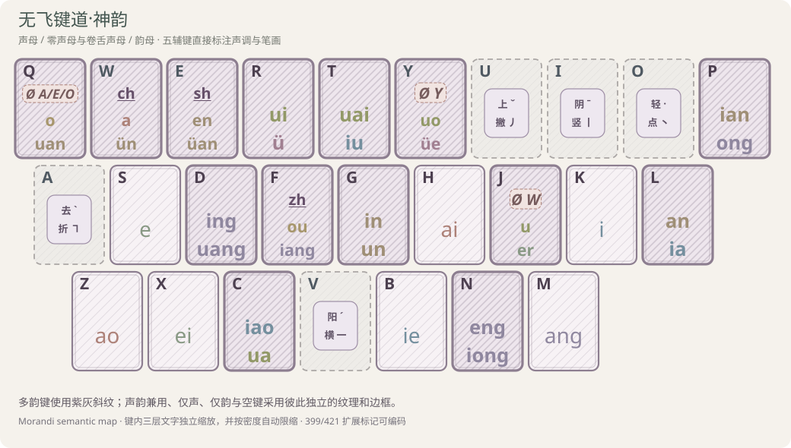
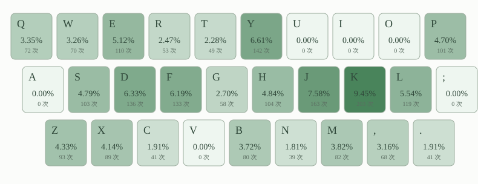

# [冰雪拼音](https://input.tansongchen.com)

> 优雅、高效、个性化的中文输入体验

[简体中文](#简体中文) · [English](#english) · [繁體中文](#繁體中文) · [下载 Release](https://gitee.com/xie-chenzhu/rime-snow-pinyin/releases/latest)

<a id="简体中文"></a>
## 简体中文

配方： ℞ **snow-pinyin**

[冰雪拼音](https://input.tansongchen.com)是一系列以普通话拼音为基础的中文输入方案。它们充分利用汉字的字音信息来实现自然优雅的编码；它们使用先进的离散优化技术和顶功技术来设计，使得编码十分高效；它们配备了智能算法，通过学习用户的语言习惯来个性化输入体验。

[冰雪拼音](https://input.tansongchen.com)包括[冰雪四拼](https://input.tansongchen.com/snow4/)、[冰雪三拼](https://input.tansongchen.com/snow3/)、[冰雪双拼](https://input.tansongchen.com/snow2/)、[冰雪一拼](https://input.tansongchen.com/snow1/)和[冰雪键道](https://input.tansongchen.com/snow-jiandao/)输入方案。您可以阅读[冰雪奇缘](https://input.tansongchen.com/snow.html)来概览各个方案，了解它们的设计理念及优缺点。您还可以点击上述各个方案的链接以进一步了解并选择适合您的输入方案。

### 无飞键道神韵・双拼

[冰雪键道](https://input.tansongchen.com/snow-jiandao/)和[冰雪三拼](https://input.tansongchen.com/snow3/)现共用 **无飞键道·神韵**，使用 21×21 声韵键域和 5 个互斥辅键 `IVUAO`。

**声韵映射**



**R10 日常八场景文稿 纯双拼键频图（含标点）**



双拼热力图基于日常八场景文稿的 2149 次击键。

注意：只包含双拼部分，5 辅键未参与评估。

#### 声韵编码规则

普通声母均使用固定首键：

| 声母 | 首键 | 声母 | 首键 | 声母 | 首键 |
| --- | :---: | --- | :---: | --- | :---: |
| b | B | p | P | m | M |
| f | F | d | D | t | T |
| n | N | l | L | g | G |
| k | K | h | H | j | J |
| q | Q | x | X | zh | F |
| ch | W | sh | E | r | R |
| z | Z | c | C | s | S |

零声母完整码如下：

| 前导组 | 首键 | 完整音节编码 |
| --- | :---: | --- |
| ØA | Q | a=QW · ai=QH · an=QL · ang=QM · ao=QZ |
| ØE | Q | e=QS · ei=QX · en=QE · eng=QN · er=QJ |
| ØO | Q | o=QQ · ou=QF |
| ØY | Y | ya=YW · yan=YL · yang=YM · yao=YZ · ye=YS · yi=YK · yin=YG · ying=YD · yo=YQ · yong=YP · you=YF · yu=YR · yuan=YE · yue=YY · yun=YW |
| ØW | J | wa=JW · wai=JH · wan=JL · wang=JM · wei=JX · wen=JE · weng=JN · wo=JQ · wu=JJ |

韵母使用第二键；`v` 表示 `ü`，`ve` 表示 `üe`：

| 第二键 | 韵母 | 第二键 | 韵母 | 第二键 | 韵母 |
| :---: | --- | :---: | --- | :---: | --- |
| W | a / vn | H | ai | L | an / ia |
| M | ang | Z | ao | S | e |
| X | ei | E | en / van | N | eng / iong |
| K | i | P | ian / ong | F | iang / ou |
| C | iao / ua | B | ie | G | in / un |
| D | ing / uang | T | iu / uai | Q | o / uan |
| J | u / er | R | ui / v（ü） | Y | uo / ve（üe） |

- `zh/ch/sh → F/W/E`；零声母载体 `AOE/Y/W → Q/Y/J`。
- `j/q/x` 的 `u/uan/ue/un` 与零声母 YU 系列统一按 `v/van/ve/vn` 编码。
- 三拼声调 `I/V/U/A/O → 一/二/三/四/轻`；键道形码 `A/V/U/I/O → 折/横/撇/竖/点`。
- R10 的 [Common399](https://github.com/more-14-different/shuangpin-layout-benchmark) 全覆盖；实现另按同一规则推导 17 个扩展音节。`hng、m、n、ng、ê` 不编码。

#### R10 与 [S005](https://github.com/more-14-different/shuangpin-layout-benchmark)、[首道 B04](https://sspai.com/post/108949) 的公平比较

三方案共用 [Common399](https://github.com/more-14-different/shuangpin-layout-benchmark)、冻结 20 合同、字词/形码数据和模型；[S005](https://github.com/more-14-different/shuangpin-layout-benchmark) 是 21×21 的同键域基线，[B04 首道](https://sspai.com/post/108949)是 26×26 的同环境基线。

| 指标 | 神韵 | [原键道 S005](https://github.com/more-14-different/shuangpin-layout-benchmark) | [首道 B04](https://sspai.com/post/108949) | 何为好 |
| --- | ---: | ---: | ---: | --- |
| [M-R2](https://github.com/more-14-different/shuangpin-layout-benchmark) 记忆项[^m-r2] | 40 🥇 | 44 | 51 | 越低越好 |
| 不同二键码（[Common399](https://github.com/more-14-different/shuangpin-layout-benchmark)）[^common399] | 373 | 372 | 399 🥇 | 越高重码越少 |
| 裸 S2 [CKT](https://github.com/zhanghaozhecn/conditional-keystroke-timing)（ms/项）[^ckt] | 70.4936 🥇 | 82.0288 | 79.8901 | 越低越好 |
| 规则补全 [CKT](https://github.com/zhanghaozhecn/conditional-keystroke-timing)（ms/项）[^ckt] | 82.0379 | 90.2571 | 79.8901 🥇 | 固定五进制补全模型 |
| [系综当量 v5](https://github.com/more-14-different/shuangpin-layout-benchmark)[^ensemble-v5] | 10.4131 🥇 | 11.4790 | 11.0912 | 越低越好 |
| [系综当量 v4](https://github.com/more-14-different/shuangpin-layout-benchmark)[^ensemble-v4] | 10.7489 | 10.8058 | 10.5833 🥇 | 越低越好 |
| [系综当量 v6-CW150](https://github.com/more-14-different/shuangpin-layout-benchmark)[^ensemble-v6] | 9.4988 🥇 | 10.0000 | 9.5896 | 越低越好；排除 S2 |
| [LU-v1r](https://github.com/more-14-different/shuangpin-layout-benchmark)[^lu] | 74.5231 | 78.8976 | 83.1074 🥇 | 越高越一致 |
| S2 同指连击率[^sfb] | 3.26% 🥇 | 11.64% | 11.34% | 越低越好 |
| S2 同键率[^repeat] | 3.34% 🥇 | 5.06% | 4.56% | 越低越好 |
| S2 左右手交替率[^alternation] | 56.22% | 53.84% | 56.33% 🥇 | 非独立速度结论 |
| S2 主键区占比[^home] | 51.93% 🥇 | 49.00% | 36.60% | 越高越集中 |
| 20 合同右小指峰值[^right-pinky] | 5.10% | 2.77% | 1.89% 🥇 | 越低峰值越小 |
| 20 合同最大单指峰值[^max-finger] | 26.17% 🥇 | 29.53% | 29.27% | 越低峰值越小 |
| 日常纯汉字 [MX34](https://macroxue.github.io/shuangpin/eval.html)[^mx34] | 140.7933 🥇 | 134.6090 | 138.6378 | 同文稿越高越好；不含消歧 |
| 默认说明兼容标点 [MX34](https://macroxue.github.io/shuangpin/eval.html)[^mx34] | 148.5876 | 153.6883 | 156.1501 🥇 | 敏感性参考 |

[R10 完整公平对比](reports/shenyun-v2-r10-comparison.md)提供详细指标和分场景结果；[原始 JSON 快照](reports/shenyun-v2-r10-comparison.json)可供机器复核。

[^m-r2]: 在 [Common399](https://github.com/more-14-different/shuangpin-layout-benchmark) 口径下计数非原键声韵映射及额外分派规则，表示需要记忆的映射／路由项数。来源：[双拼布局 Benchmark](https://github.com/more-14-different/shuangpin-layout-benchmark)。
[^common399]: 399 个共同音节实际得到的不同二键码数量；数量越少，音节重码越多。来源：[双拼布局 Benchmark](https://github.com/more-14-different/shuangpin-layout-benchmark)。
[^ckt]: [CKT](https://github.com/zhanghaozhecn/conditional-keystroke-timing) 按音节或编码项频率加权估算条件击键时间；“裸 S2”只含声韵二键，“规则补全”给重码桶各项追加等长五进制后缀。来源：[双拼布局 Benchmark](https://github.com/more-14-different/shuangpin-layout-benchmark)、[Conditional Keystroke Timing](https://github.com/zhanghaozhecn/conditional-keystroke-timing)。
[^ensemble-v5]: 以 [CKT](https://github.com/zhanghaozhecn/conditional-keystroke-timing) 为唯一计时模型，对冻结的 20 个编码合同相对基线归一化后取四次幂均值的综合分。来源：[双拼布局 Benchmark](https://github.com/more-14-different/shuangpin-layout-benchmark)、[Conditional Keystroke Timing](https://github.com/zhanghaozhecn/conditional-keystroke-timing)。
[^ensemble-v4]: 历史综合分：在冻结 20 合同上等权汇总公开击键当量与几何模型，再取四次幂均值。来源：[双拼布局 Benchmark](https://github.com/more-14-different/shuangpin-layout-benchmark)、[yuhao-assess 当量表](https://github.com/forfudan/yuhao-assess/blob/main/public/settings/equivTable.json)；网站说明：[宇浩输入法·统计指标](https://zhuyuhao.com/yu/docs/statistics.html)。
[^ensemble-v6]: 实验性字词情景分：单字与二字词各半，在 19 个合同的组内 [CKT](https://github.com/zhanghaozhecn/conditional-keystroke-timing) 上加入 `150 ms × 非首选率`，并以 [S005](https://github.com/more-14-different/shuangpin-layout-benchmark)＝10 归一化；不含抽象 S2。来源：[双拼布局 Benchmark](https://github.com/more-14-different/shuangpin-layout-benchmark)、[Conditional Keystroke Timing](https://github.com/zhanghaozhecn/conditional-keystroke-timing)。
[^lu]: 0–100 的规则统一度，综合声韵拆分一致性、韵类规则支持和声母规律性，并取五种拆分模板中的最高分。来源：[双拼布局 Benchmark](https://github.com/more-14-different/shuangpin-layout-benchmark)。
[^sfb]: [Common399](https://github.com/more-14-different/shuangpin-layout-benchmark) 裸声韵二键由同一手指连续击打的频率加权占比。来源：[双拼布局 Benchmark](https://github.com/more-14-different/shuangpin-layout-benchmark)。
[^repeat]: [Common399](https://github.com/more-14-different/shuangpin-layout-benchmark) 裸声韵二键落在同一物理键上的频率加权占比。来源：[双拼布局 Benchmark](https://github.com/more-14-different/shuangpin-layout-benchmark)。
[^alternation]: [Common399](https://github.com/more-14-different/shuangpin-layout-benchmark) 裸声韵二键由左右手交替击打的频率加权占比；它不能单独代表输入速度。来源：[双拼布局 Benchmark](https://github.com/more-14-different/shuangpin-layout-benchmark)。
[^home]: [Common399](https://github.com/more-14-different/shuangpin-layout-benchmark) 裸声韵击键落在键盘主行的频率加权占比。来源：[双拼布局 Benchmark](https://github.com/more-14-different/shuangpin-layout-benchmark)。
[^right-pinky]: 每个合同先汇总右小指负责的 P、[、]、反斜线、;、'、/ 击键占比，再取 20 个合同中的最高值。来源：[双拼布局 Benchmark](https://github.com/more-14-different/shuangpin-layout-benchmark)。
[^max-finger]: 每个合同先按手指汇总其负责键的击键占比，再取所有手指、所有 20 合同中的最高值。来源：[双拼布局 Benchmark](https://github.com/more-14-different/shuangpin-layout-benchmark)。
[^mx34]: 在 [macroxue](https://macroxue.github.io/shuangpin/eval.html) 原生 30 键移动手模型上扩展 [、]、反斜线、' 四键，按 `200 × 有效输出字符数 ÷ 相对总时间` 评分；两行分别回放日常八场景纯汉字和原站默认说明兼容标点，均不含形辅、空格或选重。来源：[macroxue/shuangpin](https://github.com/macroxue/shuangpin)；在线评测：[双拼方案评测和优化](https://macroxue.github.io/shuangpin/eval.html)。

结论是：相对同键域 [S005](https://github.com/more-14-different/shuangpin-layout-benchmark)，神韵的主要优势是裸 S2 [CKT](https://github.com/zhanghaozhecn/conditional-keystroke-timing)、同指连击、主键区覆盖和日常文稿路径，代价是加权非首选音节、补全额外键、右小指峰值和较低 [LU](https://github.com/more-14-different/shuangpin-layout-benchmark)。相对 [B04](https://sspai.com/post/108949)，神韵以更小键域取得若干裸码和路径优势，但 [B04](https://sspai.com/post/108949) 在零碰撞、补全、部分小指/行区负载与若干综合分上更好。神韵是综合折中前沿，不是全指标支配；模型分数也不等同真人测速。

```powershell
bun scripts/验证神韵双拼.ts "路径/a7_CKT_R10_integrated.html"
bun scripts/生成神韵R10对比.ts "路径/a7_CKT_R10_integrated.html"
bun run --cwd scripts keyboard:extract -- "路径/a7_CKT_R10_integrated.html"
bun scripts/导出神韵热力图.ts "路径/a7_CKT_R10_integrated.html"
```

#### 神韵固顶与二字词简码

固顶表与简码概况：

- `AA` 的 441 个位置由 377 个二码单字和 64 个二简完整覆盖；其中 59 个二简使用天然空码，5 个让极冷音码下沉到第三键。
- 三拼 630 当前为 105 个二码位＋509 个三码位；键道 630 为 105＋525。低质量槽位允许留空，每码只固定一个候选，父子码不重复固定同一词。
- 三拼二字词二、三码候选清单见 [`snow_sanpin.fixed.630.txt`](snow_sanpin.fixed.630.txt)：630 个理论码位中 550 个有合法候选，每码最多列 10 项，供逐级选词复核，不直接替代一码一候选的固顶表。
- [二字词逐级排序结果](reports/sipin-bigram-ranking-research.md)覆盖 133,205 条可编码读音。
- 多字轻声 `de/le` 尾词改走 `;`/`/` 尾字键；已有结构略码、完整码首选或日常收益不足的词不强占固顶位。

```powershell
bun scripts/生成神韵固顶词.ts
bun scripts/生成神韵固顶词.ts --check
bun scripts/生成三拼简词.ts
bun scripts/生成三拼简词.ts --check
bun scripts/验证神韵双拼.ts
```

批量校验覆盖布局快照、421 音节、规则分支、空间数量、编码公式、一码一候选、父子码/词语重复、生成结果时效，以及尾字键和结构略码约束。

### 快捷键

以下只列[冰雪键道](https://input.tansongchen.com/snow-jiandao/)、[冰雪四拼](https://input.tansongchen.com/snow4/)、[冰雪清韵](https://input.tansongchen.com/snow-qingyun/)和[冰雪三拼](https://input.tansongchen.com/snow3/)均可使用的快捷键。

#### 候选选择与翻页

| 功能 | 快捷键 |
| --- | --- |
| 确认当前高亮候选 | `Space` |
| 选择当前页第 2～6 候选 | `2 / 3 / 8 / 9 / 0` |
| 上移/下移一个候选 | `Up` / `Down`，或 `Ctrl+K` / `Ctrl+J` |
| 上移/下移两个候选 | `Ctrl+H` / `Ctrl+L` |
| 下一页 | `Tab`、`Ctrl+V` 或 `Page_Down` |
| 上一页 | `Ctrl+M`、`Alt+V` 或 `Page_Up`；翻页后也可用 `Shift+Tab` |

#### 输入码编辑与定位

| 功能 | 快捷键 |
| --- | --- |
| 光标左移/右移一位 | `Left` / `Right`，或 `Ctrl+B` / `Ctrl+F` |
| 光标移到输入码开头/末尾 | `Home` / `End`，或 `Ctrl+A` / `Ctrl+E` |
| 从输入码开头右移两位 | `Ctrl+P`（`Home → Right → Right`） |
| 输入码物理左移/右移并在边界循环 | `Ctrl+Y` / `Ctrl+O` |
| 上一个/下一个逻辑字位或音节 | `Ctrl+U` / `Ctrl+I` |
| 定位或推进到第 1～4 字位/输入末尾 | `1 / 4 / 5 / 6 / 7` |
| 撤销最近一次选词，否则删除光标前一个输入码 | `BackSpace` |
| 回退一个音节 | `Ctrl+BackSpace` |
| 删除光标后的输入码 | `Delete` 或 `Ctrl+D` |
| 清空当前输入 | `Escape`、`Ctrl+G` 或 `Ctrl+[` |
| 以词定字：上屏当前多字候选的首字/末字 | `[` / `]` |

#### 上屏方式

| 功能 | 快捷键 |
| --- | --- |
| 上屏原始输入码 | `Enter` |
| 上屏转换后的脚本文本 | `Ctrl+Enter` |
| 上屏当前候选的注释 | `Ctrl+Shift+Enter` |

#### 输入模式与方案开关

| 功能 | 快捷键 |
| --- | --- |
| 切换结束/缓冲 | `Ctrl+.` |
| 切换到下一个输入方案 | `Ctrl+Shift+1` |
| 切换中/西文 | `Ctrl+Shift+2` |
| 切换半角/全角 | `Ctrl+Shift+3` |
| 切换简体/繁体 | `Ctrl+Shift+4` |
| 切换中文/西文标点 | `Ctrl+Shift+5` |

#### 历史、删词与方案固定词

| 功能 | 快捷键 |
| --- | --- |
| 在历史面板选择第 2～6 项 | `Ctrl+2/3/8/9/0` 或 `Alt+2/3/8/9/0` |
| 删除高亮的普通 Rime 用户词 | `Ctrl+Delete` |
| 固定/取消固定当前候选 | `Ctrl+,` |
| 开始手动加词；再次按下完成添加 | `Ctrl+'`；过程中可按 `Escape` 取消 |
| 将已固定候选上移/下移一位 | `Ctrl+[` / `Ctrl+]` |
| 重置当前编码下的方案固定候选 | `Ctrl+\` |

普通 Rime 用户词和方案固定词是两套机制：前者使用 `Ctrl+Delete` 删除；通过 `Ctrl+'` 手动加入的方案固定词，选中后使用 `Ctrl+,` 取消或禁用。静态 YAML 词典中的正式词条不能通过快捷键删除。

### 关于词库的说明

[冰雪拼音](https://input.tansongchen.com)词库收词范围与[雾凇拼音](https://github.com/iDvel/rime-ice)相同。其特点为：

1. 大词库：与[雾凇拼音](https://github.com/iDvel/rime-ice)共享 180 万词库
2. 持续更新：上游[雾凇拼音](https://github.com/iDvel/rime-ice)更新后，本仓库也会随之更新
3. 单字读音遵循《通用规范汉字字典》规范
4. 词语读音尽可能使用单字已有的读音，便于自动造词。这意味着
    - 不考虑因弱化产生的轻声，如「知识」为 `zhī shí`，不为 `zhī shi`
    - 不考虑连读变调，如「一个」为 `yī gè`，不为 `yí gè`
    - 部分专有名词中的专用音允许例外，例如「冒顿」可以是 `mò dú`

---

<a id="english"></a>
## English

Recipe: ℞ **snow-pinyin**

[Snow Pinyin](https://input.tansongchen.com) is a family of Mandarin-based Chinese input methods. It combines phonetic information, discrete optimization, top-up coding, and adaptive learning for natural, efficient, and personalized input. The family includes [Snow Four-Code](https://input.tansongchen.com/snow4/), [Snow Three-Code](https://input.tansongchen.com/snow3/), [Snow Double Pinyin](https://input.tansongchen.com/snow2/), [Snow One-Code](https://input.tansongchen.com/snow1/), and [Snow KeyTao](https://input.tansongchen.com/snow-jiandao/).

### [Wufei KeyTao · Shenyun](https://input.tansongchen.com/snow-jiandao/) double-pinyin layout

[Snow KeyTao](https://input.tansongchen.com/snow-jiandao/) and [Snow Three-Code](https://input.tansongchen.com/snow3/) now share **[Wufei KeyTao · Shenyun](https://input.tansongchen.com/snow-jiandao/)**, using a 21×21 sound-code domain and five disjoint auxiliary keys, `IVUAO`.

**Initial/final mapping**


**R10 daily-document pure-double-pinyin key-frequency map (with punctuation)**


The double-pinyin heat map contains 2,149 keystrokes from eight daily-use scenarios.

Note: It covers only the double-pinyin layer; the five auxiliary keys were not evaluated.

#### Coding rules

All ordinary initials have a fixed first key; the exceptions to the letter itself are `zh/ch/sh → F/W/E`. Zero-onset carriers are `AOE/Y/W → Q/Y/J`. Finals are mapped as follows (`v` means `ü`):

| Key | Finals | Key | Finals | Key | Finals |
| :---: | --- | :---: | --- | :---: | --- |
| W | a / vn | H | ai | L | an / ia |
| M | ang | Z | ao | S | e |
| X | ei | E | en / van | N | eng / iong |
| K | i | P | ian / ong | F | iang / ou |
| C | iao / ua | B | ie | G | in / un |
| D | ing / uang | T | iu / uai | Q | o / uan |
| J | u / er | R | ui / v | Y | uo / ve |

The `j/q/x` u-series and the zero-onset YU series normalize to `v/van/ve/vn`. [Three-Code](https://input.tansongchen.com/snow3/) tone keys are `I/V/U/A/O → 1/2/3/4/neutral`; [KeyTao](https://input.tansongchen.com/snow-jiandao/) shape keys are `A/V/U/I/O → bend/horizontal/left-falling/vertical/dot`. [Common399](https://github.com/more-14-different/shuangpin-layout-benchmark) is fully covered, 17 extension syllables are derived by the same rules, and `hng/m/n/ng/ê` remain unencoded.

#### Fair R10 comparison with [S005](https://github.com/more-14-different/shuangpin-layout-benchmark) and [Shoudao B04](https://sspai.com/post/108949)

The three layouts use the same [Common399](https://github.com/more-14-different/shuangpin-layout-benchmark) data, frozen 20 contracts, dictionaries, shapes, and models. [S005](https://github.com/more-14-different/shuangpin-layout-benchmark) is the same-domain 21×21 baseline; [B04](https://sspai.com/post/108949) is a 26×26 same-environment baseline.

| Metric | Shenyun | [KeyTao S005](https://github.com/more-14-different/shuangpin-layout-benchmark) | [Shoudao B04](https://sspai.com/post/108949) |
| --- | ---: | ---: | ---: |
| [M-R2](https://github.com/more-14-different/shuangpin-layout-benchmark) | 40 🥇 | 44 | 51 |
| Unique [Common399](https://github.com/more-14-different/shuangpin-layout-benchmark) two-key codes | 373 | 372 | 399 🥇 |
| Bare S2 [CKT](https://github.com/zhanghaozhecn/conditional-keystroke-timing) (ms/item) | 70.4936 🥇 | 82.0288 | 79.8901 |
| Completion-aware [CKT](https://github.com/zhanghaozhecn/conditional-keystroke-timing) | 82.0379 | 90.2571 | 79.8901 🥇 |
| [系综当量 v5](https://github.com/more-14-different/shuangpin-layout-benchmark) | 10.4131 🥇 | 11.4790 | 11.0912 |
| [系综当量 v4](https://github.com/more-14-different/shuangpin-layout-benchmark) | 10.7489 | 10.8058 | 10.5833 🥇 |
| [系综当量 v6-CW150](https://github.com/more-14-different/shuangpin-layout-benchmark) | 9.4988 🥇 | 10.0000 | 9.5896 |
| [LU-v1r](https://github.com/more-14-different/shuangpin-layout-benchmark) | 74.5231 | 78.8976 | 83.1074 🥇 |
| S2 same-finger rate | 3.26% 🥇 | 11.64% | 11.34% |
| S2 home-area share | 51.93% 🥇 | 49.00% | 36.60% |
| 20-contract right-pinky peak | 5.10% | 2.77% | 1.89% 🥇 |
| Daily Han-only [MX34](https://macroxue.github.io/shuangpin/eval.html) | 140.7933 🥇 | 134.6090 | 138.6378 |

The [complete R10 comparison](reports/shenyun-v2-r10-comparison.md) provides detailed metrics and per-scenario results. A [raw JSON snapshot](reports/shenyun-v2-r10-comparison.json) is available for machine review.

Against [S005](https://github.com/more-14-different/shuangpin-layout-benchmark), Shenyun's main wins are bare [CKT](https://github.com/zhanghaozhecn/conditional-keystroke-timing), same-finger rate, home-area coverage, and daily-document paths; its costs include weighted misses, completion keys, right-pinky peaks, and lower [LU](https://github.com/more-14-different/shuangpin-layout-benchmark). Against [B04](https://sspai.com/post/108949) there is no overall dominance: Shenyun gets several bare-code and path benefits in a smaller domain, while [B04](https://sspai.com/post/108949) wins collision freedom, completion, several load measures, and some aggregates. These are model results, not human speed tests.

#### Fixed candidates and staged two-character abbreviations

The current layout produces 64 two-key abbreviations plus 377 two-key characters, 105+509 [Three-Code](https://input.tansongchen.com/snow3/) 630 candidates, and 105+525 [KeyTao](https://input.tansongchen.com/snow-jiandao/) 630 candidates. [`snow_sanpin.fixed.630.txt`](snow_sanpin.fixed.630.txt) separately records up to ten two-character candidates for each populated two- and three-key [Three-Code](https://input.tansongchen.com/snow3/) slot: 550 of 630 theoretical slots are populated. This audit list does not replace the one-candidate-per-code fixed tables.

The [staged bigram ranking study](reports/sipin-bigram-ranking-research.md) also checks 133,205 encodable readings along the real [Four-Code](https://input.tansongchen.com/snow4/) completion path. It found no automatic replacement that both improves multiple stages and remains non-first at full code, so the evidence is retained without forcing extra fixed-candidate changes.

```powershell
bun scripts/生成神韵固顶词.ts --check
bun scripts/生成三拼简词.ts --check
bun scripts/验证神韵双拼.ts
```

### Dictionaries

[Snow Pinyin](https://input.tansongchen.com) follows the vocabulary scope of [Rime Ice](https://github.com/iDvel/rime-ice): roughly 1.8 million shared entries, continuous upstream synchronization, standard single-character readings, and predictable word pronunciations suitable for user-defined words.

---

<a id="繁體中文"></a>
## 繁體中文

配方： ℞ **snow-pinyin**

[冰雪拼音](https://input.tansongchen.com)是一系列以普通話拼音為基礎的中文輸入方案，結合字音資訊、離散最佳化、頂功技術與使用習慣學習，提供自然、高效且個人化的輸入體驗。系列包含[冰雪四拼](https://input.tansongchen.com/snow4/)、[冰雪三拼](https://input.tansongchen.com/snow3/)、[冰雪雙拼](https://input.tansongchen.com/snow2/)、[冰雪一拼](https://input.tansongchen.com/snow1/)及[冰雪鍵道](https://input.tansongchen.com/snow-jiandao/)。

### 無飛鍵道神韻・雙拼

[冰雪鍵道](https://input.tansongchen.com/snow-jiandao/)與[冰雪三拼](https://input.tansongchen.com/snow3/)現共用 **無飛鍵道·神韻**，使用 21×21 聲韻鍵域與 5 個互斥輔鍵 `IVUAO`。

**聲韻映射**


**R10 日常八場景文稿 純雙拼鍵頻圖（含標點）**


雙拼熱力圖基於日常八場景文稿的 2149 次擊鍵。

注意：只包含雙拼部分，5 輔鍵未參與評估。

#### 聲韻規則

普通聲母均使用固定首鍵，`zh/ch/sh → F/W/E`；零聲母載體為 `AOE/Y/W → Q/Y/J`。韻母映射如下（`v` 表示 `ü`）：

| 第二鍵 | 韻母 | 第二鍵 | 韻母 | 第二鍵 | 韻母 |
| :---: | --- | :---: | --- | :---: | --- |
| W | a / vn | H | ai | L | an / ia |
| M | ang | Z | ao | S | e |
| X | ei | E | en / van | N | eng / iong |
| K | i | P | ian / ong | F | iang / ou |
| C | iao / ua | B | ie | G | in / un |
| D | ing / uang | T | iu / uai | Q | o / uan |
| J | u / er | R | ui / v | Y | uo / ve |

`j/q/x` 的 u 系列與零聲母 YU 系列統一成 `v/van/ve/vn`。[三拼](https://input.tansongchen.com/snow3/)聲調鍵為 `I/V/U/A/O → 一/二/三/四/輕`，[鍵道](https://input.tansongchen.com/snow-jiandao/)形碼鍵為 `A/V/U/I/O → 折/橫/撇/豎/點`。[Common399](https://github.com/more-14-different/shuangpin-layout-benchmark) 全覆蓋，另依同一規則推導 17 個擴充音節；`hng、m、n、ng、ê` 不編碼。

#### R10 與 [S005](https://github.com/more-14-different/shuangpin-layout-benchmark)、[首道 B04](https://sspai.com/post/108949) 的公平比較

三方案共用 [Common399](https://github.com/more-14-different/shuangpin-layout-benchmark)、凍結 20 合約、詞形資料與模型；[S005](https://github.com/more-14-different/shuangpin-layout-benchmark) 是 21×21 的同鍵域基線，[B04](https://sspai.com/post/108949) 是 26×26 的同環境基線。

| 指標 | 神韻 | [原鍵道 S005](https://github.com/more-14-different/shuangpin-layout-benchmark) | [首道 B04](https://sspai.com/post/108949) |
| --- | ---: | ---: | ---: |
| [M-R2](https://github.com/more-14-different/shuangpin-layout-benchmark) | 40 🥇 | 44 | 51 |
| [Common399](https://github.com/more-14-different/shuangpin-layout-benchmark) 不同二鍵碼 | 373 | 372 | 399 🥇 |
| 裸 S2 [CKT](https://github.com/zhanghaozhecn/conditional-keystroke-timing)（ms/項） | 70.4936 🥇 | 82.0288 | 79.8901 |
| 補全後 [CKT](https://github.com/zhanghaozhecn/conditional-keystroke-timing) | 82.0379 | 90.2571 | 79.8901 🥇 |
| [系综当量 v5](https://github.com/more-14-different/shuangpin-layout-benchmark) | 10.4131 🥇 | 11.4790 | 11.0912 |
| [系综当量 v4](https://github.com/more-14-different/shuangpin-layout-benchmark) | 10.7489 | 10.8058 | 10.5833 🥇 |
| [系综当量 v6-CW150](https://github.com/more-14-different/shuangpin-layout-benchmark) | 9.4988 🥇 | 10.0000 | 9.5896 |
| [LU-v1r](https://github.com/more-14-different/shuangpin-layout-benchmark) | 74.5231 | 78.8976 | 83.1074 🥇 |
| S2 同指連擊率 | 3.26% 🥇 | 11.64% | 11.34% |
| S2 主鍵區占比 | 51.93% 🥇 | 49.00% | 36.60% |
| 20 合約右小指峰值 | 5.10% | 2.77% | 1.89% 🥇 |
| 日常純漢字 [MX34](https://macroxue.github.io/shuangpin/eval.html) | 140.7933 🥇 | 134.6090 | 138.6378 |

[R10 完整公平對比](reports/shenyun-v2-r10-comparison.md)提供詳細指標與分場景結果；另附[原始 JSON](reports/shenyun-v2-r10-comparison.json)供機器複核。

相對 [S005](https://github.com/more-14-different/shuangpin-layout-benchmark)，神韻的主要優勢是裸 [CKT](https://github.com/zhanghaozhecn/conditional-keystroke-timing)、同指連擊、主鍵區覆蓋與日常文稿路徑；代價是加權非首選、補全鍵、右小指峰值與較低 [LU](https://github.com/more-14-different/shuangpin-layout-benchmark)。相對 [B04](https://sspai.com/post/108949) 並無全指標支配：神韻以較小鍵域取得若干裸碼與路徑優勢，[B04](https://sspai.com/post/108949) 則在零碰撞、補全、部分負載與若干綜合分勝出。這些均是模型值，而非真人測速。

#### 固頂與二字詞逐級簡碼

當前方案生成 64 個二簡與 377 個二碼單字；三拼 630 為 105＋509，鍵道 630 為 105＋525。[`snow_sanpin.fixed.630.txt`](snow_sanpin.fixed.630.txt)另列三拼二字詞二、三碼候選：630 個理論碼位中 550 個有候選，每碼最多 10 項，供逐級複核，不取代「一碼一候選」固頂表。

[二字詞逐級排序結果](reports/sipin-bigram-ranking-research.md)覆蓋 133,205 條可編碼讀音。

```powershell
bun scripts/生成神韵固顶词.ts --check
bun scripts/生成三拼简词.ts --check
bun scripts/验证神韵双拼.ts
```

### 詞庫說明

[冰雪拼音](https://input.tansongchen.com)的收詞範圍與[霧凇拼音](https://github.com/iDvel/rime-ice)相同，包含約 180 萬共享詞條、持續上游同步、規範單字讀音，以及適合自動造詞的穩定詞語讀音。
